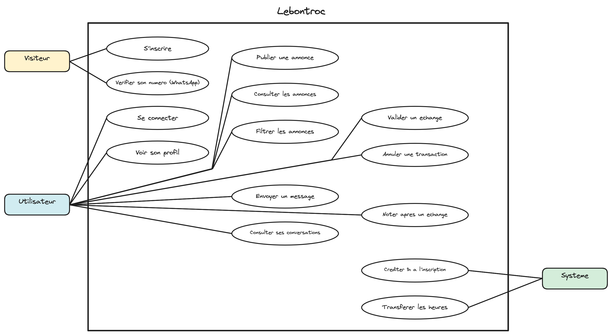
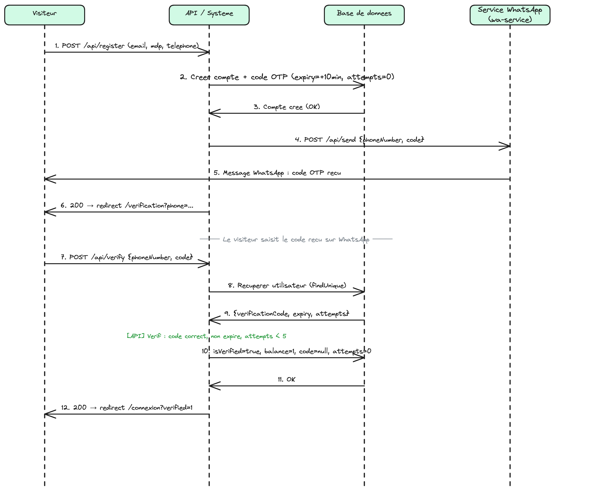
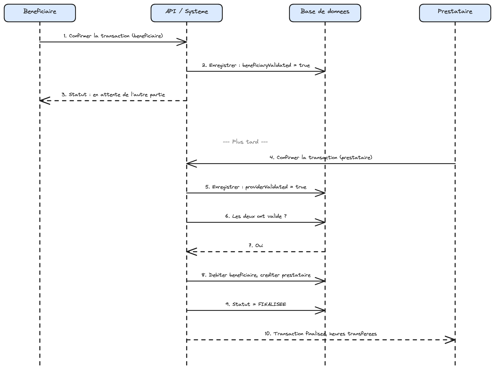

# Conception: Lebontroc

## Diagramme de cas d'utilisation

[Justification](use-cases.md)

---

## Diagramme de classes

[Justification](diagramme-classes.md)

---

## Diagrammes de séquence

### Inscription et vérification WhatsApp

### Double validation d'une transaction

[Justification et étapes détaillées](diagrammes-sequence.md)

---

## Contrats d'interface (API REST)

[Voir le détail](contrats-api.md)

---

## Adaptations selon les contraintes

[Voir le détail](adaptations-contraintes.md)

| Contrainte | Adaptation |
|------------|------------|
| RGPD | Base de données PostgreSQL hébergée sur le VPS OVH, en France (zone EU) |
| RGPD | Aucune donnée bancaire stockée, monnaie de temps uniquement |
| Sécurité | Vérification du numéro de téléphone par WhatsApp avant activation du compte |
| Sécurité | Rate limiting sur les endpoints d'envoi pour limiter les abus WhatsApp |
| Technique | Next.js full-stack : pas de séparation front/back pour réduire la complexité |
| Technique | PostgreSQL pour garantir l'intégrité des mouvements d'heures (transactions ACID) |
| Financier | Tout sur le VPS de l'équipe (app, service WhatsApp, base), pas de service managé payant |
| Légal | Solde négatif interdit, aucun découvert possible |
