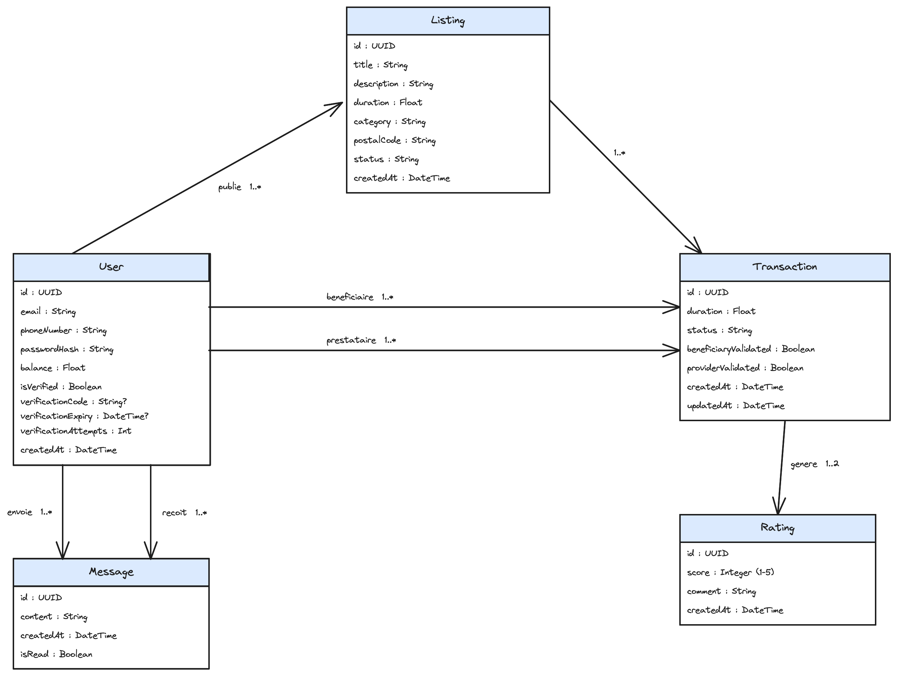

# Diagramme de classes

## Diagramme

## Justification

Cinq entités, voilà le modèle.

**User** porte les infos du compte. L'identifiant de connexion est l'**email** avec un mot de passe (hashé bcrypt). Le **numéro de téléphone** ne sert que pour la vérification via WhatsApp, jamais pour se connecter. Le champ `balance` est le solde en heures. `isVerified` passe à true quand le numéro est confirmé. Les trois champs `verificationCode`, `verificationExpiry` et `verificationAttempts` gèrent le code OTP actif, son expiration et le compteur de tentatives. Tant que `isVerified` est false, pas de crédit initial et pas de transaction possible.

**Listing**, c'est une annonce. Un utilisateur peut en publier plusieurs. Une même annonce peut générer plusieurs transactions si le service est rendu plusieurs fois.

**Transaction** est l'entité centrale du mécanisme d'échange. Deux booléens : `beneficiaryValidated` et `providerValidated`. Quand les deux sont à true, le transfert d'heures s'exécute et le statut passe à `FINALISEE`. On évite comme ça les états intermédiaires bancals. Le transfert lui-même tourne dans une transaction SQL atomique pour ne jamais avoir un débit sans crédit.

**Message** gère la messagerie. Un utilisateur envoie ET reçoit, donc deux associations distinctes vers la même classe.

**Rating** sert à noter un échange après finalisation. Une transaction génère une ou deux notes (le bénéficiaire note le prestataire, ou l'inverse, ou les deux), d'où la multiplicité 1..2.
