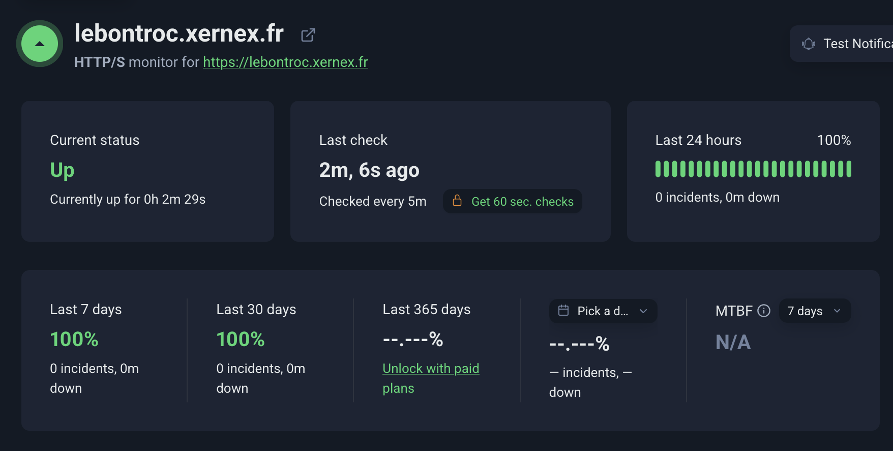

# Stratégie de déploiement: Lebontroc

## Infrastructure cible

L'application est accessible publiquement à l'adresse **https://lebontroc.xernex.fr**.

L'hébergement repose sur le VPS de l'équipe. Trois conteneurs Docker tournent en parallèle, orchestrés par Docker Compose :

| Conteneur | Rôle | Port interne |
|-----------|------|-------------|
| `lebontroc-app` | Application Next.js | 3000 (exposé sur 5000) |
| `lebontroc-wa` | Service WhatsApp (Baileys) | 3001 (interne uniquement) |
| `lebontroc-db` | Base PostgreSQL 18 | 5432 (interne uniquement) |

La base PostgreSQL tournait au départ sur Railway (service managé, région EU Frankfurt). L'offre gratuite étant limitée par un crédit mensuel, on l'a rapatriée sur le VPS dans un conteneur dédié. Les données sont persistées dans le volume Docker `lebontroc_db_data`. La base n'est jamais exposée hors du réseau Docker interne.

## Pipeline CI/CD

Le pipeline est géré par GitHub Actions (`.github/workflows/ci.yml`). Il se déclenche à chaque push sur `main` et à chaque Pull Request. Il est composé de deux jobs : `ci` (lint + tests + build sur un runner GitHub hébergé) et `deploy` (exécution sur un self-hosted runner installé sur le VPS).

### Étapes du pipeline

```
Push sur main
    │
    ▼
─── Job 1 : ci (ubuntu-latest, runner GitHub) ───
[1] Checkout du code
    │
    ▼
[2] Setup Node.js 20 (avec cache npm)
    │
    ▼
[3] npm ci (installation des dépendances)
    │
    ▼
[4] npx prisma generate (génération du client typé)
    │
    ▼
[5] npm run lint (ESLint, bloque si erreur)
    │
    ▼
[6] npm test (tests unitaires, bloque si échec)
    │
    ▼
[7] npm run build (Next.js + Turbopack, bloque si erreur)
    │
    ▼  (uniquement si push sur main, pas sur PR)
─── Job 2 : deploy (self-hosted runner sur le VPS) ───
[8] git pull origin main
    │
    ▼
[9] docker compose up --build -d (rebuild et bascule)
    │
    ▼
[10] docker image prune -f (nettoyage des images obsolètes)
```

### Pourquoi un self-hosted runner ?

Par défaut GitHub Actions tourne sur des runners Azure. Pour déployer sur notre VPS OVH, on avait deux options : ouvrir SSH aux plages IP GitHub (plus de 1000 blocs CIDR, ingérable dans le pare-feu OVH), ou installer un agent sur le VPS qui se connecte sortant vers GitHub. On a pris la deuxième : aucun port entrant à ouvrir, le runner récupère les jobs en HTTPS sortant.

Les secrets utilisés par le pipeline (DATABASE_URL, NEXTAUTH_SECRET) sont stockés dans les secrets GitHub du dépôt, jamais dans le code.

## Stratégie de déploiement : rolling update

On fait du **rolling update** : Docker Compose reconstruit le conteneur avec la nouvelle image, le met en service, puis vire l'ancien. Pendant la reconstruction (30 à 60 secondes), le conteneur déjà en place sert encore les requêtes. Pas d'interruption pour les utilisateurs.

C'est adapté à notre contexte (4 personnes, trafic faible, un seul VPS) :
- Pas besoin d'infra redondante (contrairement au blue/green)
- Natif dans Docker Compose (`up --build -d`)
- RTO sous les 2 minutes en cas de pépin (rollback via `git revert` + redéploiement automatique)

## Procédure de mise en production

1. Merger la PR sur `main` via GitHub
2. GitHub Actions lance le job `ci` (lint + tests + build) sur un runner Ubuntu hébergé
3. Si `ci` passe, le job `deploy` est dispatché vers le self-hosted runner du VPS, qui exécute :
   ```bash
   cd /home/debian/5alm-myth
   git pull origin main
   docker compose up --build -d
   docker image prune -f
   ```
4. L'application est accessible sur https://lebontroc.xernex.fr (exposition publique via Cloudflare)

## Migrations de la base

Le pipeline ne lance pas `prisma migrate deploy` automatiquement. Les migrations sont appliquées à la main, ce qui reste rare (uniquement quand le schéma change).

Au premier démarrage du conteneur `db`, ou après une nouvelle migration, depuis `/home/debian/5alm-myth/app` :

```bash
docker run --rm --network lebontroc_default --env-file .env \
  -v "$PWD":/work -w /work node:20-alpine \
  sh -c "npm ci && npx prisma migrate deploy"
```

Les données sont persistées dans le volume `lebontroc_db_data`, donc cette étape n'est pas à refaire à chaque déploiement.

## Procédure de rollback

En cas de régression détectée après déploiement :

```bash
# Depuis n'importe quel poste
git revert HEAD --no-edit
git push origin main
# Le pipeline CD se relance automatiquement et redéploie la version précédente
```

Si le pipeline est cassé, rollback manuel sur le VPS :
```bash
cd /home/debian/5alm-myth
git checkout <commit-précédent>
docker compose up --build -d
```

## Variables d'environnement en production

Stockées dans `app/.env` sur le VPS (`/home/debian/5alm-myth/app/.env`), jamais dans le dépôt Git. Les variables critiques (DATABASE_URL, AUTH_SECRET) sont également déclarées comme secrets GitHub pour que le job `ci` puisse compiler l'application sans accéder au VPS.

## Monitoring

On surveille avec **UptimeRobot** : ping HTTP/S toutes les 5 minutes sur https://lebontroc.xernex.fr.



Le dashboard nous donne plusieurs métriques utiles :
- **Current status** : état temps réel du service (Up / Down)
- **Last 24 hours / 7 days / 30 days** : pourcentage de disponibilité sur la période, avec le nombre d'incidents et la durée totale d'indisponibilité
- **Last check** : timestamp du dernier ping
- **MTBF** : Mean Time Between Failures, temps moyen entre deux pannes

### Alerte configurée

Une alerte email part vers l'équipe si l'app est inaccessible **plus de 2 minutes** (au moins 2 pings KO consécutifs sur l'intervalle de 5 minutes). Le choix de 2 minutes est calé sur notre profil de trafic : avec un trafic faible (quelques visites par jour pendant la phase de démo), un downtime de moins de 2 minutes est probablement un rebuild Docker en cours pendant un déploiement (cf. stratégie rolling update plus haut), pas un vrai incident. Au-delà, on veut être prévenus tout de suite pour intervenir.

### Logs applicatifs

```bash
docker compose logs -f app
docker compose logs -f wa-service
```

*Lebontroc, Projet ALM M2 HESIAS, 2025-2026*
