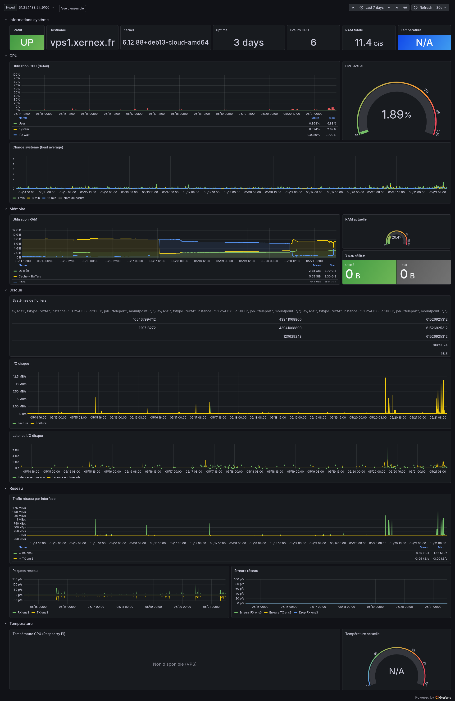
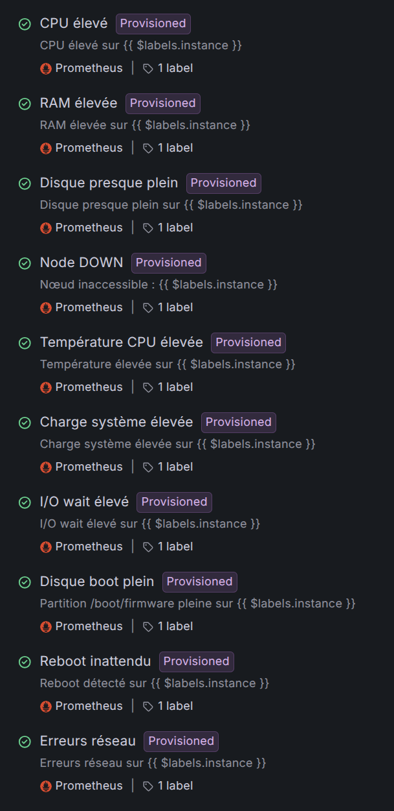

# Plan de maintenance: Lebontroc

## Incidents possibles

| ID | Description | Criticité | Comment le détecter | Comment le résoudre | Délai cible |
|----|-------------|-----------|---------------------|---------------------|-------------|
| INC-01 | L'application est inaccessible | Haute | Alerte UptimeRobot + alerte Grafana `Node DOWN` | Rollback via git revert, pipeline CD redéploie automatiquement | 5 min |
| INC-02 | Un échange débite les heures deux fois | Haute | Remontée d'un utilisateur | Correction manuelle du solde + correctif + nouveau déploiement | 1 h |
| INC-03 | Impossible de se connecter | Haute | Remontée d'un utilisateur | Rollback vers la version précédente | 15 min |
| INC-04 | Les annonces ne s'affichent plus | Moyenne | Remontée d'un utilisateur | Correctif sur une branche → merge → redéploiement manuel (git push origin main, pipeline CD redéploie via docker compose) | 2 h |
| INC-05 | Perte de données suite à une migration ratée | Critique | Alertes Grafana (`Disque presque plein`, `RAM élevée`, `I/O wait élevé`) + erreurs dans les logs Docker | Restauration du dernier dump PostgreSQL (pg_dump planifié, voir section Sauvegardes) | 4 h |

## Compromis techniques acceptés

| ID | Ce qu'on a simplifié | Conséquence | Ce qu'on ferait en v2 |
|----|---------------------|-------------|----------------------|
| DT-01 | Pas de pagination sur la liste des annonces | Si beaucoup d'annonces, la page peut être longue à charger | Ajouter une pagination |
| DT-02 | Les erreurs de formulaire ne s'affichent qu'après envoi | L'expérience utilisateur est moins fluide | Valider les champs en temps réel côté navigateur |
| DT-03 | Les transactions ne s'annulent pas automatiquement si elles restent sans réponse | Des transactions peuvent rester ouvertes indéfiniment | Ajouter un mécanisme d'expiration automatique après 7 jours |

## Sauvegardes de la base

La base PostgreSQL a été rapatriée de Railway vers un conteneur sur le VPS (voir adaptations selon les contraintes). On perd au passage les sauvegardes automatiques que Railway fournissait, donc on les remplace par un `pg_dump` planifié.

Une tâche cron tourne chaque nuit à 3h sur le VPS. Elle exporte la base dans un fichier daté et supprime les dumps de plus de 7 jours :

```cron
0 3 * * * docker exec lebontroc-db pg_dump -U lebontroc lebontroc > /home/debian/backups/lebontroc-$(date +\%F).sql && find /home/debian/backups -name "lebontroc-*.sql" -mtime +7 -delete
```

Les dumps sont stockés dans `/home/debian/backups/`. Restauration en cas d'incident :

```bash
cat /home/debian/backups/lebontroc-AAAA-MM-JJ.sql \
  | docker exec -i lebontroc-db psql -U lebontroc lebontroc
```

## Monitoring et alertes

Le VPS est supervisé par une stack **Prometheus + Grafana + node_exporter** colocalisée sur `vps1.xernex.fr`. Ce monitoring vient combler deux faiblesses de la version initiale du plan : (1) la détection des incidents reposait essentiellement sur les remontées utilisateurs et la lecture manuelle de `docker compose logs`, (2) on n'avait aucune visibilité système (CPU/RAM/disque/réseau) pour anticiper une panne.

### Dashboard temps réel



Le dashboard agrège les métriques système exposées par `node_exporter` : uptime, charge CPU, utilisation mémoire, occupation disque, I/O, trafic réseau, latence réseau et température. Les valeurs sont scrappées par Prometheus et historisées, ce qui permet à la fois la lecture instantanée (état actuel du VPS) et l'analyse de tendance (saturation progressive, fuite mémoire, pic de trafic).

### Règles d'alerte provisionnées



Onze règles d'alerte sont déclarées en *provisioning* (versionnées avec la configuration Grafana, donc reproductibles sur un autre environnement). Elles couvrent :

- **Santé du nœud** : `Node DOWN` (le VPS ne répond plus au scrape), `Reboot inattendu` (redémarrage détecté hors fenêtre de maintenance)
- **Ressources** : `CPU élevé`, `RAM élevée`, `Charge système élevée`, `I/O wait élevé`, `Température CPU élevée`
- **Stockage** : `Disque presque plein` (volume principal), `Disque boot plein` (partition `/boot/firmware`, souvent oubliée et qui peut bloquer un upgrade kernel)
- **Réseau** : `Erreurs réseau` (paquets en erreur sur les interfaces)

Chaque règle est rattachée à la source `Prometheus` et taguée avec un label permettant le routing. Le canal de notification configuré est **l'email** : toute alerte qui passe à l'état `firing` envoie un mail à l'équipe d'astreinte.

## Niveaux de service

| Indicateur | Objectif | Comment on le mesure | Que fait-on si c'est dépassé |
|-----------|---------|---------------------|------------------------------|
| Disponibilité | 99 % par semaine | UptimeRobot (sonde externe toutes les 5 min) + alerte Grafana `Node DOWN` (sonde interne) | Alerte email + investigation |
| Temps de réponse | Moins de 500 ms en moyenne | Métriques exposées dans Grafana/Prometheus (latence requête, charge serveur) | On cherche la requête qui ralentit |
| Taux d'erreurs serveur | Moins de 1 % | UptimeRobot + logs Docker | Alerte + rollback si ça dépasse 5 % |

## Mises à jour des dépendances

On utilise Dependabot, configuré sur le dépôt GitHub. Une fois par semaine, il ouvre automatiquement des pull requests pour les dépendances qui ont une mise à jour disponible. Le CI tourne dessus, et la PR n'est mergeable que si lint + tests + build passent.

Configuration dans `.github/dependabot.yml` : deux écosystèmes (npm dans `app/` et dans `service/`), planning hebdomadaire, regroupement des mises à jour mineures pour limiter le bruit.

### Dashboard Dependabot


Le dashboard montre l'historique des scans. On voit ici que Dependabot a déjà tourné plusieurs fois sur `app/package.json`. Le job le plus récent a abouti à l'ouverture de la PR #9. Les jobs précédents en erreur "Dependabot cannot open any more pull requests" signalent qu'on a atteint la limite par défaut de 5 PR ouvertes simultanément : ce n'est pas un bug, c'est un garde-fou pour éviter de noyer l'équipe sous les PR.

### Exemple de PR générée


Sur cette PR, Dependabot a généré automatiquement :
- Un titre au format Conventional Commits (`chore(deps-dev): bump eslint from 9.39.4 to 10.4.0 in /app`)
- Une branche dédiée (`dependabot/npm_and_yarn/app/eslint-10.4.0`) sur laquelle le CI tourne
- Le corps de la PR avec les release notes et les commits du package
- Un score de compatibilité (28% ici, calculé sur l'historique des PR similaires dans d'autres projets, indication que le passage en majeur peut avoir des breaking changes à vérifier)
- La signature commit (badge "Verified") pour prouver que la PR vient bien du bot et pas d'un attaquant

L'équipe relit la PR, vérifie que les checks CI passent, et merge si tout va bien.

## Limites actuelles et pistes d'évolution

Le monitoring couvre aujourd'hui la **couche système** (VPS, OS, ressources). Il ne couvre pas encore la **couche applicative** : on ne mesure pas la latence par endpoint Next.js, le taux d'erreur 5xx applicatif, ni l'état des jobs internes (par exemple le service WhatsApp Baileys). En v3, ajouter un APM (par ex. exporter Prometheus depuis l'app Next + middleware de mesure côté Hono/Express) permettrait de fermer cette boucle.

*Lebontroc, Projet ALM M2 HESIAS, 2025-2026*
